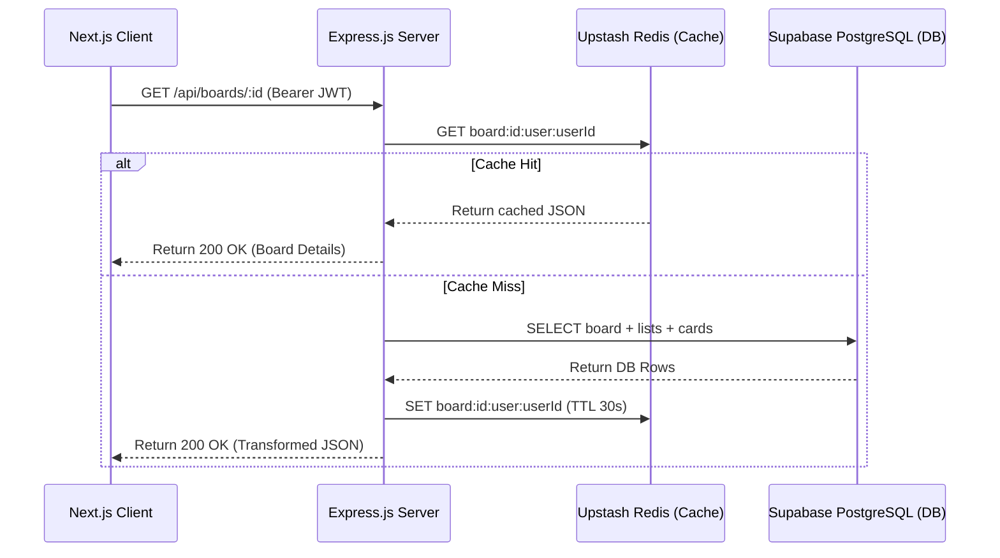

# Repository Audit & Architectural Review: FlowLoG

## 1. Executive Architecture Summary

FlowLoG is a full-stack Kanban-style project management application built with a modern decoupled client-server architecture. 

### Technology Stack
*   **Frontend Client:** Next.js 16 (App Router), React 19, TypeScript, Vanilla CSS Modules, and `@hello-pangea/dnd` for interactive drag-and-drop board manipulation.
*   **Backend Server:** Node.js, Express.js 5, and Prisma ORM.
*   **Database:** PostgreSQL (hosted on Supabase).
*   **Caching Layer:** Upstash Redis accessed via HTTP REST Client (`@upstash/redis`).
*   **Third-Party Integrations:**
    *   **Google AI Studio (Gemini API):** Powering FlowGuide AI (a Gemma 4 31B IT natural-language Kanban query data assistant).
    *   **Razorpay:** Indian payment gateway for processing premium Pro upgrades.
    *   **Resend / NodeMailer SMTP:** Transacting collaborator workspace invites and card assignment notifications.
*   **Deployment Architecture:** Monorepo with two decoupled workspaces: Next.js frontend (Vercel) and Express.js backend (Render).

---

## 2. Tech Stack & Project Folder Structure

```
FlowLoG/
├── client/                     # Next.js App Workspace
│   ├── app/                    # Next.js App Router (Layouts & Routes)
│   │   ├── b/[id]/             # Dynamic Kanban Board visualization routes
│   │   ├── dashboard/          # User Dashboard (Board list, subscription details)
│   │   ├── join/[token]/       # Workspace invitation acceptance route
│   │   ├── login/ / signup/    # User access portals
│   │   └── providers.tsx       # React App Context Wrappers (Theme, Toast, Sidebar)
│   ├── components/             # Reusable UI Components & Modals
│   ├── contexts/               # Theme, Sidebar, and Toast notification contexts
│   └── utils/api.ts            # Fetch wrapper client interacting with backend APIs
│
├── server/                     # Node.js/Express.js Backend Workspace
│   ├── controllers/            # Request handlers orchestrating business logic
│   ├── middleware/             # Route guards (Auth verification, Premium features check)
│   ├── prisma/                 # Prisma schemas, migration files, and seeds
│   ├── routes/                 # Express API mount points & route matching
│   └── utils/                  # Shared helper services (caching, mailing, access checks)
│
└── Review/                     # Architectural reports & code audits
```

---

## 3. Core Architectural flows & Design Patterns

### Data Flow
1.  **Client Interactions:** Users interact with the drag-and-drop board, triggering client-side React state updates and calling `apiClient` wrappers in `client/utils/api.ts`.
2.  **API Requests:** API calls carry the `Authorization: Bearer <JWT>` header pointing to the Express server.
3.  **Middlewares:** Express intercepts the call, verifying authentication via JWT and board membership via helper guards.
4.  **Controllers & Caching:** Controllers check Upstash Redis cache first for reads. On cache miss or mutations, Prisma queries PostgreSQL, updates/invalidates cache, and returns JSON.



### Authentication Flow
Authentication is built on signed JSON Web Tokens (JWT).
1.  **Signup/Login:** User posts credentials to `/api/auth/signup` or `/api/auth/login`. Password hashes are checked using `bcryptjs`.
2.  **Token Issuance:** A JWT signed with `JWT_SECRET` (HS256) is returned containing `{ userId }` with a 7-day expiration.
3.  **Client Storage:** The token is kept in `localStorage` under `authToken`.
4.  **Route Protection:** `authMiddleware` intercepts routes, extracts/decodes the bearer token, checks database integrity (ensuring the user was not deleted), and attaches `req.userId` and `req.isPremium`.

---

## 4. Database Schema & Caching Strategy Audit

### Prisma Schema Design
The PostgreSQL schema uses 11 main models:
*   `User` (holds passwords, avatar paths, subscription states).
*   `Board` (linked to `User` as owner, supports a string-based dynamic `shareToken`).
*   `BoardMember` (Unique composite index on `[boardId, userId]`).
*   `List` (stores Kanban lanes, maintains `order` index).
*   `Card` (Kanban items, optional `dueDate`, relations to labels/assignees).
*   `Checklist` & `ChecklistItem` (nested tasks supporting toggles).
*   `CardLabel` & `CardMember` (join tables mapping cards to labels and assignees).
*   `Invitation` (tracks collaborator tokens and emails sent).

### Caching Layer Analysis (Upstash Redis)
*   **Design Pattern:** Cache-aside. Board retrieval and subscription state queries read from Redis and fallback to the DB, caching for 30s (boards) to 600s (subscriptions).
*   **Cache Invalidation:** Mutation operations (creates, updates, deletes, reordering) trigger invalidation patterns like `deleteCachePattern` to flush outdated caches.
*   **System Daemons:** `keepAlive.js` runs recurring background tasks:
    1.  **HTTP Ping:** Hits `/api/health` every 9 minutes to prevent Render from spinning down active instances.
    2.  **DB Ping:** Executes `SELECT 1` raw query every 4 minutes to keep the Supabase database pool warm and prevent auto-pauses.

---

## 5. Security Audit (Security Engineer perspective)

### Strengths
1.  **Cryptographically Strong Tokens:** Workspace invitations and shared board tokens use `crypto.randomBytes(32)` instead of insecure randomizers (like `Math.random()`), preventing token prediction attacks.
2.  **Bcrypt Password Hashing:** Uses `bcryptjs` with 12 rounds to block brute-force attacks on credentials.
3.  **Strict Write Route Verification:** `requireAuth.js` middleware rejects writing actions from unauthenticated users or guest sessions.
4.  **Access Guards:** Resource mutations verify that the requesting user owns or is a verified collaborator of the target board via helper services before making modifications.
5.  **Database User verification:** The auth middleware checks the database to verify the user is still active before validating the session, preventing access from deleted accounts carrying valid tokens.

### Issues & Recommendations
1.  **Raw SQL Input Potential:** The reordering queries (`reorderCards` and `reorderLists`) construct queries with string interpolation (`$executeRawUnsafe`). While IDs and order values are verified programmatically as integers beforehand, raw string interpolation in DB queries is a security anti-pattern.
    *   *Recommendation:* Refactor query construction using parameterized templates or safe array inputs to ensure absolute SQL injection immunity.

---

## 6. Performance Audit (Performance Engineer perspective)

### Strengths
1.  **Select Column Pruning:** Instead of fetching complete database records on nested queries, boards and users fetches explicitly select only required columns (e.g. excluding password hashes, unnecessary dates), drastically reducing database memory footings and client payload transfer overheads.
2.  **Bulk Updates:** The card and list reordering logic uses raw SQL `CASE WHEN` queries to process reorders in a single database roundtrip rather than spawning N sequential queries.

### Issues & Recommendations
1.  **CRITICAL: Redundant PrismaClient Instantiations:**
    Instead of using the shared connection pool client located at `server/prismaClient.js`, multiple files invoke `new PrismaClient()` independently:
    *   `server/index.js` (Line 10)
    *   `server/middleware/auth.js` (Line 12)
    *   `server/controllers/subscriptionController.js` (Line 2)
    
    This breaks connection pool management, instantiates multiple parallel connection pools, and can quickly deplete Supabase connection slots.
    *   *Recommendation:* Remove the redundant `new PrismaClient()` statements and uniformly import the shared instance:
        ```javascript
        const prisma = require('../prismaClient');
        ```

2.  **Broad Cache Eviction:**
    In `server/controllers/checklistController.js`, mutations trigger a broad wildcard invalidation:
    ```javascript
    await deleteCachePattern(`board:*:user:*`);
    ```
    This completely flushes cached board states for **all users and all boards** in the database whenever a checklist item is added or toggled.
    *   *Recommendation:* Retrieve the parent card's `boardId` inside the checklist controller, and limit the invalidation to that specific board context:
        ```javascript
        await deleteCachePattern(`board:${boardId}:user:*`);
        ```

---

## 7. Software Architecture Summary Report

```
                      +-------------------+
                      |   Next.js Client  |
                      |   (Vercel Host)   |
                      +---------+---------+
                                |
                   (HTTPS / REST APIs / Bearer JWT)
                                |
                                v
                      +-------------------+
                      |   Express Server  |
                      |   (Render Host)   |
                      +---+-----+-----+---+
                          |     |     |
            +-------------+     |     +-------------+
            |                   |                   |
            v                   v                   v
     +------------+      +------------+      +--------------+
     |   Upstash  |      |  Supabase  |      |  Google AI   |
     |    Redis   |      | PostgreSQL |      |    Studio    |
     |   (Cache)  |      | (Database) |      |   (Gemma 4)  |
     +------------+      +------------+      +--------------+
```

### FlowGuide AI Query Engine Execution Flow
1.  **Natural Query:** User enters text prompt into chat (e.g. *"How many cards are overdue?"*).
2.  **Query Generation Pass:** The Express controller calls Google AI Studio (`models/gemma-4-31b-it`) using the `systemInstruction` to map the question into a structured Prisma read operation JSON object (validating against whitelisted operations like `card.findMany` and filtering out thinking parts).
3.  **Scope Enforcement:** The controller dynamically injects `where: { list: { board: { ownerId: userId } } }` to guarantee data isolation.
4.  **Database Execution:** The Prisma query runs safely against PostgreSQL.
5.  **Summarization Pass:** Results are sent back to Gemma 4 to formulate a friendly, plain-text answer returned to the client.
